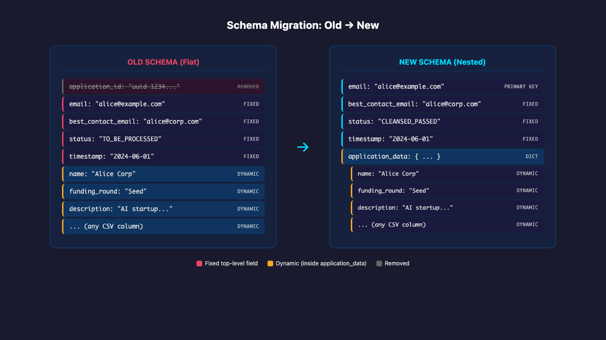
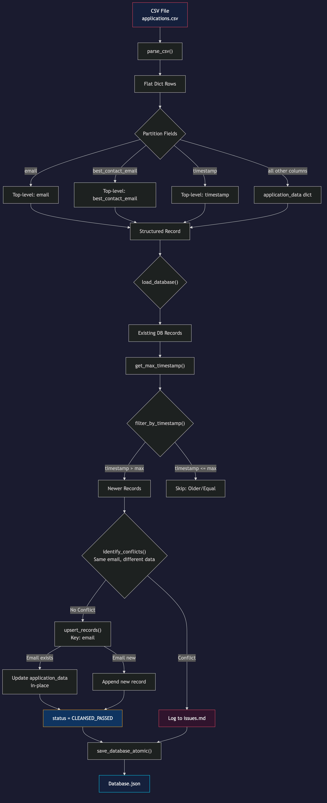
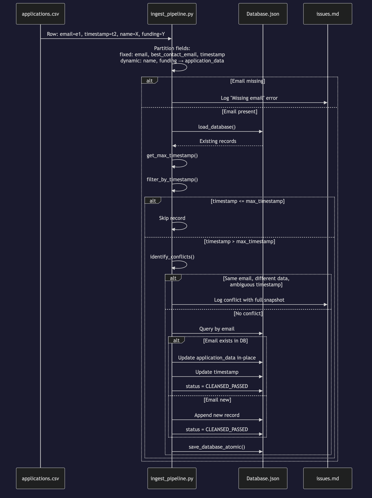

# Issue #76: Re-implement PRD-1 with Email-Primary Schema and `application_data` Dict

## Summary

Re-architect `ingest_pipeline.py` to use `email` as the primary key (replacing `application_id`/UUIDv4) and nest all dynamic CSV fields inside an `application_data` dictionary. Update `cleanse_pipeline.py` to align with the new record structure. The design principle is **flexibility first**: only `email`, `best_contact_email`, `status`, `timestamp`, and `application_data` are fixed top-level fields; everything inside `application_data` is completely dynamic.

## Root Cause Analysis

The current implementation hard-codes a flat record structure where every CSV column becomes a top-level field. This creates several problems:

1. **Schema rigidity**: Adding a new CSV column requires the database record format to change implicitly — old records lack the new field, and code may accidentally depend on specific field names.
2. **Identity fragmentation**: Using `application_id` (UUIDv4) as the primary key separates the ingestion identity from the natural business key (`email`), requiring duplicate tracking.
3. **Cleanse pipeline coupling**: `cleanse_pipeline.py` currently looks up records by `application_id` and quarantine-logs by `application_id`, which becomes meaningless when the source of truth is `email`.
4. **Status flow mismatch**: PRD-1 originally set `TO_BE_PROCESSED`, but the updated PRD-1 requires `CLEANSED_PASSED` directly after ingestion since the incoming CSV is already considered sanitized.

## Proposed Solution

### High-Level Approach

1. **Refactor `ingest_pipeline.py`**:
   - Parse CSV and partition fields into fixed top-level (`email`, `best_contact_email`, `timestamp`) vs. dynamic (`application_data`).
   - Remove all `uuid` and `application_id` generation/lookup logic.
   - Rewrite `upsert_records` to key by `email` instead of `application_id`.
   - Rewrite conflict detection: a conflict occurs when two records share the same `email` but have different `application_data` snapshots **without** a strictly newer timestamp to resolve the ambiguity.
   - Set `status = "CLEANSED_PASSED"` on ingestion (not `"TO_BE_PROCESSED"`).
   - Preserve atomic persistence and incremental delta filtering.

2. **Refactor `cleanse_pipeline.py`**:
   - Update `load_candidates` to query by `status == "TO_BE_PROCESSED"` (for backward compatibility with records already in that state) or work on `CLEANSED_PASSED` if no `TO_BE_PROCESSED` records exist.
   - Change record lookups from `application_id` to `email`.
   - Update `log_quarantine` to reference `email` instead of `application_id`.
   - Ensure `regex_cleanse` walks the `application_data` subtree, not the entire record (to avoid mutating fixed fields like `email` and `timestamp`).

3. **Rewrite test suites**:
   - `test_ingest_pipeline.py`: ~29 tests rewritten for email-primary upsert, `application_data` dict, `CLEANSED_PASSED` status, missing-email logging, and flexible schema.
   - `test_cleanse_pipeline.py`: ~46 tests updated for `email`-based lookups and `application_data` cleansing.

4. **Update documentation**:
   - Move `prd-1-application-ingestion-modification-service.md` from `backlog/` to `completed/` once implemented.

## Files to Modify

| File | Change |
|------|--------|
| `ingest_pipeline.py` | Remove `uuid` import; rewrite `upsert_records` to key by `email`; nest dynamic fields into `application_data`; set `status = "CLEANSED_PASSED"`; update conflict detection |
| `cleanse_pipeline.py` | Replace `application_id` lookups with `email`; quarantine log by `email`; cleanse only `application_data` subtree; update `load_candidates` logic |
| `tests/test_ingest_pipeline.py` | Rewrite all tests for new schema: email upsert, `application_data` dict, no UUID assertions, `CLEANSED_PASSED` status |
| `tests/test_cleanse_pipeline.py` | Update record fixtures to use `email`-primary schema; update quarantine log assertions |
| `documentation/backlog/prd-1-application-ingestion-modification-service.md` | Mark sections as implemented or move to `completed/` |

## New Files

| File | Purpose |
|------|---------|
| `tests/test_ingest_pipeline_v2.py` | *(optional)* If incremental migration is preferred, new test file for new schema while keeping old tests temporarily |

## Implementation Steps

1. **Backup & baseline**
   - Run full test suite: `pytest tests/ -v` → verify 177 passes (current baseline).
   - Create a temporary copy of `ingest_pipeline.py` and `cleanse_pipeline.py` for reference.

2. **Redesign `ingest_pipeline.py` — core logic**
   - Remove `import uuid` and all `uuid.uuid4()` calls.
   - In `upsert_records`, build `db_by_email` instead of `db_by_id`.
   - When a record arrives, extract `email`, `best_contact_email`, `timestamp` as top-level fields.
   - All remaining CSV columns go into `application_data`.
   - If `email` exists in DB and incoming timestamp > existing timestamp: update `application_data` in-place and refresh `timestamp`/`status`.
   - If `email` does not exist: append new record with `status = "CLEANSED_PASSED"`.
   - If `email` exists but incoming timestamp <= existing timestamp: skip (delta filtering already handles this, but double-check).

3. **Redesign `ingest_pipeline.py` — conflict detection**
   - Change `identify_conflicts` to group by `email`.
   - A conflict = same `email`, different `application_data`, and no clear newer timestamp winner.
   - Route conflicts to `issues.md` with full record snapshot.
   - Records without `email` are logged to `issues.md` as "missing email" (no DB insertion).

4. **Update `cleanse_pipeline.py` — schema alignment**
   - In `run_cleanse_pipeline`, build `db_by_email` instead of `db_by_id`.
   - In `log_quarantine`, use `record.get("email", "N/A")` instead of `application_id`.
   - In `regex_cleanse`, apply `walk_dict` to `record["application_data"]` instead of the full record.
   - Preserve `email`, `best_contact_email`, `status`, `timestamp`, `cleansed_at`, `cleansing_log` at top level.

5. **Rewrite `tests/test_ingest_pipeline.py`**
   - Update `_write_csv` fixtures to include `best_contact_email` column.
   - Update assertions: no `application_id` checks; check `application_data` contains dynamic fields.
   - Check `status == "CLEANSED_PASSED"` instead of `"TO_BE_PROCESSED"`.
   - Add tests for missing `email` logging.
   - Add tests for dynamic schema within `application_data`.

6. **Update `tests/test_cleanse_pipeline.py`**
   - Update `_make_record` helper to use `email`-primary schema.
   - Update quarantine log assertions to check for `email`.
   - Verify `application_data` fields are cleansed while top-level fields are untouched.

7. **Documentation & PRD status**
   - Move `documentation/backlog/prd-1-application-ingestion-modification-service.md` to `documentation/completed/`.
   - Update README project structure section.

8. **Final validation**
   - Run full test suite: `pytest tests/ -v` → target 100% pass.
   - Run manual pipeline integration test with sample CSV.
   - Verify `Database.json` output matches expected schema.

## Test Strategy

- **Unit tests**:
  - `parse_csv` still returns flat dicts (no change in CSV parsing).
  - `timestamp_greater` and `get_max_timestamp` unchanged.
  - New: `_partition_fields(record)` → correctly splits fixed vs. dynamic fields.
  - New: `upsert_records` with email key → new record, update existing, skip older.
  - New: `identify_conflicts` with `application_data` comparison.

- **Integration tests**:
  - Full pipeline run with new CSV → Database.json has correct schema.
  - Email upsert: same email, newer timestamp → `application_data` updated.
  - Email conflict: same email, different data, ambiguous timestamps → routed to `issues.md`.
  - Missing email: row without email → routed to `issues.md`, no DB insertion.
  - Dynamic columns: new CSV column appears → automatically nested in `application_data`.

- **Edge cases**:
  - Empty `application_data` (CSV has only fixed columns).
  - `best_contact_email` missing → use `email` as fallback, or log as issue.
  - Very large `application_data` payloads (10K+ chars per field).
  - Concurrent pipeline runs (atomic persistence already handles this).
  - Backward compatibility: existing `Database.json` with old flat schema → migration or graceful handling.

## Risks & Mitigations

| Risk | Mitigation |
|------|------------|
| Breaking `cleanse_pipeline.py` that already works (46 tests pass) | Update carefully; preserve all regex/gemini/quarantine logic; only change record accessors and field scope |
| Test suite explosion during rewrite | Rewrite tests incrementally; run `pytest tests/test_ingest_pipeline.py` first, then `tests/test_cleanse_pipeline.py`, then full suite |
| Hard-coding field names inside `application_data` | Code review: grep for string literals that look like CSV column names inside pipeline logic; all field access should be dynamic |
| Data loss from removing `application_id` | `application_id` is out of scope per PRD-1; no migration needed; old records with `application_id` will have it as an extra key in `application_data` if present in CSV |
| `best_contact_email` missing from CSV | Fallback to `email` if `best_contact_email` column is absent; log warning if both are missing |
| Existing `Database.json` with old flat schema | On first run, detect old schema and either auto-migrate (move non-fixed fields into `application_data`) or raise clear error |
| `cleanse_pipeline` has no `TO_BE_PROCESSED` records because ingestion now sets `CLEANSED_PASSED` | Update `load_candidates` to also query `CLEANSED_PASSED` if no `TO_BE_PROCESSED` found, or change ingestion to set `TO_BE_PROCESSED` and let cleanse set `CLEANSED_PASSED` → **decision needed** (see note below) |

> **Note on Status Flow**: The issue acceptance criteria state "Status is set to `CLEANSED_PASSED` after ingestion." However, `cleanse_pipeline.py` currently only processes `TO_BE_PROCESSED` records. Two options:
> 1. **Option A (recommended)**: Ingestion sets `CLEANSED_PASSED`. Cleanse pipeline is updated to also process `CLEANSED_PASSED` records (for edge-case re-cleansing) or is bypassed for standard flow.
> 2. **Option B**: Ingestion sets `TO_BE_PROCESSED`; cleanse pipeline runs as before and sets `CLEANSED_PASSED`. This contradicts the acceptance criteria.
>
> **Recommendation**: Implement Option A. Update `load_candidates` in `cleanse_pipeline.py` to load both `TO_BE_PROCESSED` (backward compatibility) and `CLEANSED_PASSED` (re-cleansing). This preserves the cleanse pipeline's utility while meeting the issue requirements.

## Diagrams

### Architecture: Old Schema vs. New Schema

### Data Flow: Ingestion Pipeline (New)

### Sequence: Email-Based Upsert

---

**Plan created**: 2026-06-18  
**Issue**: [#76](https://github.com/alexanderdb-rgb/Prompt-reverse-Engineering/issues/76)  
**Status**: Pending approval
