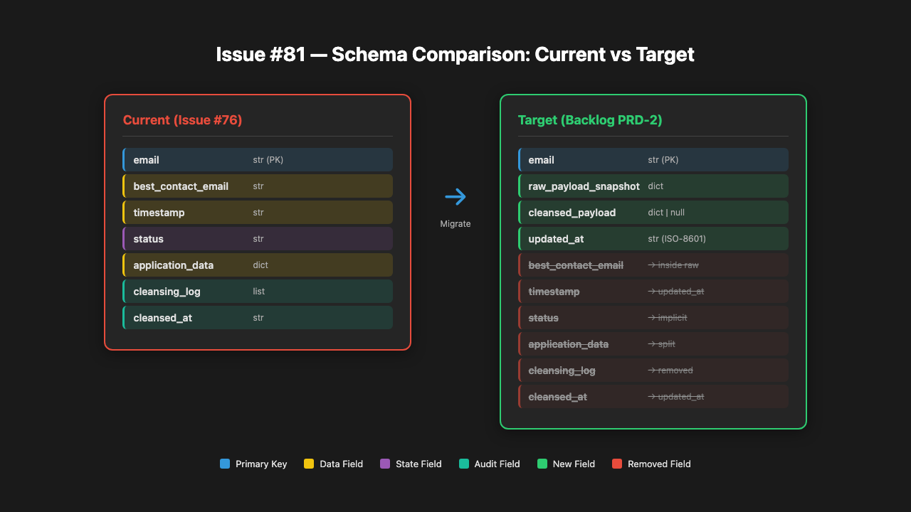
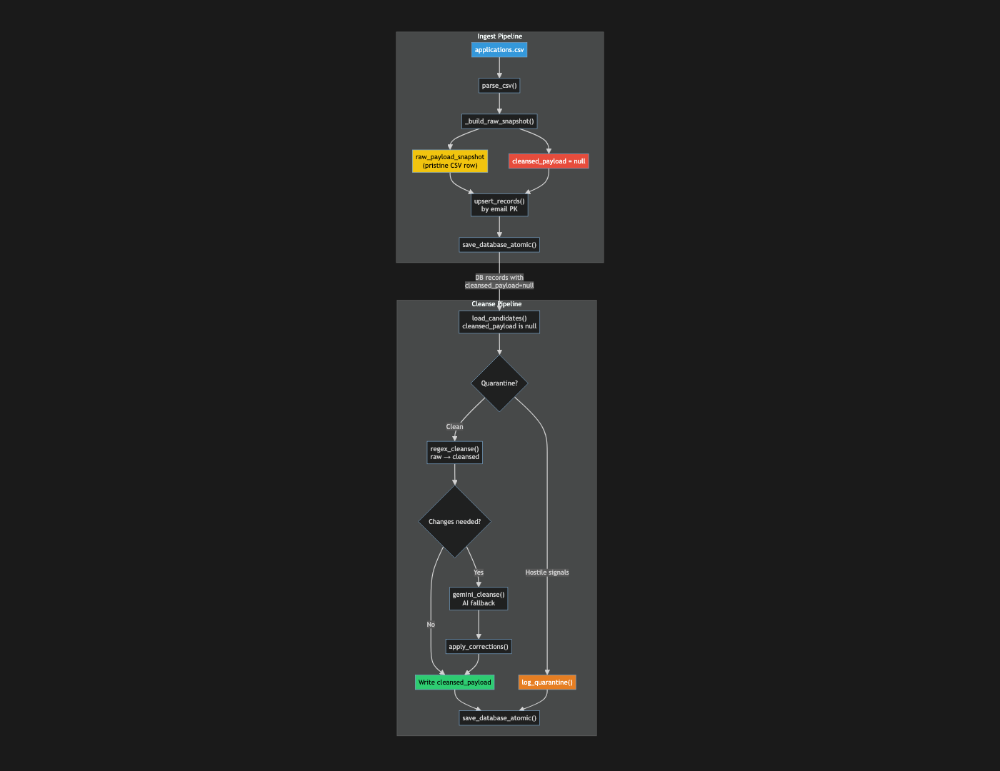
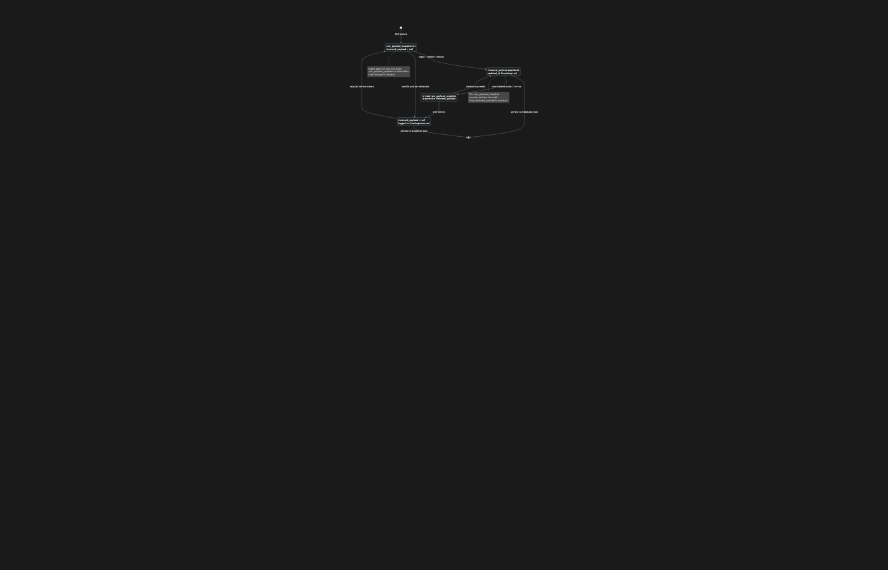

# Issue #81 – PRD-2 Re-implementation: Align Data Model with Backlog Specification

## Summary

Re-implement the Data Persistence & Cleansing Pipeline (`cleanse_pipeline.py`) and its integration with the ingestion layer (`ingest_pipeline.py`) to align with the backlog PRD-2 specification. The current implementation uses an `application_data` + `status` state-machine schema; the target specification requires a side-by-side `raw_payload_snapshot` / `cleansed_payload` architecture with `updated_at` tracking. This change restores the audit-lineage capability (pristine raw copy next to sanitized output) that was lost in the issue #76 schema migration.

---

## Root Cause Analysis

### Current State (Post-Issue #76)

The issue #76 implementation introduced an email-primary schema with these record fields:

| Field | Purpose |
|-------|---------|
| `email` | Primary key |
| `best_contact_email` | Secondary contact |
| `timestamp` | Ingestion timestamp |
| `status` | State machine (`TO_BE_PROCESSED` → `CLEANSED_PASSED` / `QUARANTINE_FAILED`) |
| `application_data` | All dynamic CSV fields nested here |
| `cleansing_log` | Audit trail array |
| `cleansed_at` | Last cleanse timestamp |

This design **collapses** raw and cleansed data into a single mutable `application_data` field. Once a record is processed, the original raw CSV values are lost unless reconstructed from external sources.

### Target State (Backlog PRD-2)

The backlog specification requires:

| Field | Type | Purpose |
|-------|------|---------|
| `email` | str (PK) | Primary key for upsert |
| `raw_payload_snapshot` | dict (Non-Nullable) | **Pristine** copy of the raw CSV row — never modified |
| `cleansed_payload` | dict (Nullable) | Sanitized copy produced by the cleansing worker |
| `updated_at` | str (ISO-8601) | Timestamp of last worker modification |

### Why This Matters

1. **Audit Lineage:** The completed PRD-2 explicitly lists "0.00% corruption rate through side-by-side preservation of pristine raw payloads and modified attributes" as a success metric. The current design violates this.
2. **Reproducibility:** If cleansing logic changes (new regex rules, updated Gemini prompts), engineers need the original raw data to re-run cleansing deterministically.
3. **Quarantine Review:** When records are quarantined, reviewers need to see both the raw input that triggered the quarantine and the attempted cleanse output.
4. **Evaluation Integrity:** PRD-3 (Evaluation Engine) expects to read from a clean `cleansed_payload` while having access to raw values for dispute resolution.

---

## Proposed Solution

### High-Level Approach

Refactor both `ingest_pipeline.py` and `cleanse_pipeline.py` to use the `raw_payload_snapshot` / `cleansed_payload` dual-payload model. Preserve the existing operational behaviors (delta filtering, conflict detection, quarantine, atomic saves) while changing the data shape.

### Architecture Changes

**Ingest Pipeline Changes:**
- Instead of partitioning CSV fields into fixed fields + `application_data`, store the **entire raw CSV row** (minus the email) into `raw_payload_snapshot`.
- Set `cleansed_payload` to `null` on initial ingestion (the cleansing worker will populate it).
- Drop `status` field — the presence/absence of `cleansed_payload` indicates processing state.
- Drop `application_data` field entirely.
- Use `updated_at` instead of `timestamp` (same semantics, clearer name).

**Cleanse Pipeline Changes:**
- Read from `raw_payload_snapshot` (never mutate it).
- Write cleansed output to `cleansed_payload`.
- Apply the same three-layer defense: quarantine detection → regex cleanse → Gemini fallback.
- On quarantine: set `cleansed_payload` to a quarantine marker or leave it `null` with a quarantine flag.
- Drop `status`, `cleansing_log`, `cleansed_at` fields — these are replaced by `updated_at` + the presence of `cleansed_payload`.

**Shared Utilities:**
- `cleanse_utils.py` remains largely unchanged (walk_dict, strip_control_chars, etc.).
- Add a helper to migrate old-schema records on first read.

---

## Files to Modify

| File | Change |
|------|--------|
| `cleanse_pipeline.py` | Refactor to read `raw_payload_snapshot` and write `cleansed_payload`. Remove `status`, `cleansing_log`, `cleansed_at`. Update `load_candidates` logic. Update `update_state`. |
| `ingest_pipeline.py` | Replace `_partition_fields` with `_build_raw_snapshot`. Store full CSV row in `raw_payload_snapshot`. Set `cleansed_payload = null`. Use `updated_at` instead of `timestamp`. Remove `status` assignment. |
| `tools/cleanse_utils.py` | Add `migrate_old_schema(record)` helper for backward compatibility. |

## New Files

| File | Purpose |
|------|---------|
| `tests/test_schema_migration.py` | Unit tests for old-schema → new-schema migration helper. |

## Implementation Steps

1. **Update `cleanse_utils.py`**
   - Add `migrate_old_schema(record)` that converts issue-76 schema records to the new format:
     - Moves `application_data` → `raw_payload_snapshot`
     - Initializes `cleansed_payload = null`
     - Copies `timestamp` → `updated_at`
     - Removes `status`, `cleansing_log`, `cleansed_at`, `best_contact_email` (if not in raw data)
   - Add `is_new_schema(record)` helper.

2. **Update `ingest_pipeline.py`**
   - Replace `_partition_fields(record)` with `_build_raw_snapshot(record)`:
     - Returns `{"email": email, "raw_payload_snapshot": {all non-email CSV fields}, "cleansed_payload": null, "updated_at": record["timestamp"]}`
   - Remove `status = "CLEANSED_PASSED"` from upsert — the ingest pipeline no longer marks records as cleansed.
   - Update `upsert_records` to use `updated_at` instead of `timestamp`.
   - Update conflict detection to compare `raw_payload_snapshot` instead of `application_data`.
   - Call `migrate_old_schema` on database records at load time if `raw_payload_snapshot` is absent.

3. **Update `cleanse_pipeline.py`**
   - Change `load_candidates` to return records where `cleansed_payload is None` (unprocessed) or where `updated_at` is older than a threshold (re-cleansing).
   - Change `regex_cleanse` to read from `record["raw_payload_snapshot"]` and produce `cleansed_payload`.
   - Change `detect_quarantine_signals` to scan `raw_payload_snapshot`.
   - Remove `update_state` function — replace with a lightweight `touch_updated_at(record)`.
   - Remove `log_quarantine` dependency on `cleansing_log`.
   - Update `run_cleanse_pipeline` orchestrator to write `cleansed_payload` instead of mutating `application_data`.

4. **Write tests**
   - `test_schema_migration.py`: Verify old records with `application_data` migrate correctly.
   - Update `test_ingest_pipeline.py`: Assert new records have `raw_payload_snapshot` and `cleansed_payload = null`.
   - Update `test_cleanse_pipeline.py`: Assert cleansed output goes to `cleansed_payload`, raw remains untouched.

5. **Run adversarial tests**
   - Execute `adversarial_test_issue76.py` equivalents to verify no regressions in quarantine, regex, and Gemini behaviors.

6. **Documentation**
   - Update module docstrings to reflect the new schema.
   - Update PRD-2 backlog → completed.

---

## Test Strategy

### Unit Tests
- `test_migrate_old_schema` — verifies all old fields map correctly, new fields are initialized.
- `test_build_raw_snapshot` — verifies CSV rows become `raw_payload_snapshot` with email extracted.
- `test_regex_cleanse_reads_raw_writes_cleansed` — verifies the read/write boundary.
- `test_raw_payload_immutable` — asserts that after cleansing, `raw_payload_snapshot` is unchanged.

### Integration Tests
- Ingest a CSV → verify database records have `raw_payload_snapshot` and `null` `cleansed_payload`.
- Run cleanse pipeline → verify `cleansed_payload` is populated and `raw_payload_snapshot` is identical to pre-cleanse.
- Re-cleanse a record → verify `updated_at` changes but `raw_payload_snapshot` remains constant.

### Edge Cases
- **Old database with mixed schemas:** Some records have `application_data`, others already have `raw_payload_snapshot`. The migration helper must handle both transparently.
- **Empty CSV fields:** These should appear as empty strings in `raw_payload_snapshot`, not be omitted.
- **Unicode/emoji in raw data:** Must survive untouched in `raw_payload_snapshot` and be NFC-normalized in `cleansed_payload`.
- **Quarantine path:** Quarantined records should have `cleansed_payload = null` (or a quarantine marker) and an intact `raw_payload_snapshot`.
- **Gemini corrections:** Corrections should be applied to `cleansed_payload`, never to `raw_payload_snapshot`.

---

## Risks & Mitigations

| Risk | Mitigation |
|------|------------|
| **Breaking existing databases** (records use old schema) | Implement `migrate_old_schema` helper; call it transparently on `load_database`. Write a one-time migration script and test it. |
| **Tests from issue #76 break** | The adversarial test file references `application_data`. Update it or create `adversarial_test_issue81.py` with the new schema assertions. |
| **Data loss during migration** | The migration copies `application_data` → `raw_payload_snapshot`; no destructive moves. The old fields are removed only after copying. |
| **Performance regression** | The new schema stores two copies of data (raw + cleansed). For 500 records/minute throughput target, this is negligible (dict references are cheap; only string values are duplicated). |
| **Quarantine records lose state** | Quarantine state is now implicit (`cleansed_payload is None` + presence in `cleaningissues.md`). Document this behavior. |

---

## Diagrams

### Schema Comparison: Current vs Target



### Pipeline Flow (Target Architecture)



### Data Lifecycle



---

## Appendix: Schema Migration Specification

### Old Record (Issue #76)

```json
{
  "email": "alice@startup.io",
  "best_contact_email": "alice@startup.io",
  "timestamp": "2024-06-01T12:00:00Z",
  "status": "CLEANSED_PASSED",
  "application_data": {
    "company_name": "Alice AI",
    "industry": "SaaS"
  },
  "cleansing_log": [
    {
      "action": "CLEANSED_PASSED",
      "timestamp": "2024-06-01T12:00:00Z",
      "reason": "Regex/Gemini cleanse completed"
    }
  ],
  "cleansed_at": "2024-06-01T12:00:00Z"
}
```

### Migrated Record (Issue #81)

```json
{
  "email": "alice@startup.io",
  "raw_payload_snapshot": {
    "best_contact_email": "alice@startup.io",
    "timestamp": "2024-06-01T12:00:00Z",
    "company_name": "Alice AI",
    "industry": "SaaS"
  },
  "cleansed_payload": {
    "best_contact_email": "alice@startup.io",
    "timestamp": "2024-06-01T12:00:00Z",
    "company_name": "Alice AI",
    "industry": "SaaS"
  },
  "updated_at": "2024-06-01T12:00:00Z"
}
```

### New Record After Ingest (Before Cleanse)

```json
{
  "email": "bob@startup.io",
  "raw_payload_snapshot": {
    "best_contact_email": "bob@startup.io",
    "timestamp": "2024-06-15T09:30:00Z",
    "company_name": "Bob's   Bots",
    "industry": "Robotics"
  },
  "cleansed_payload": null,
  "updated_at": "2024-06-15T09:30:00Z"
}
```

### New Record After Cleanse

```json
{
  "email": "bob@startup.io",
  "raw_payload_snapshot": {
    "best_contact_email": "bob@startup.io",
    "timestamp": "2024-06-15T09:30:00Z",
    "company_name": "Bob's   Bots",
    "industry": "Robotics"
  },
  "cleansed_payload": {
    "best_contact_email": "bob@startup.io",
    "timestamp": "2024-06-15T09:30:00Z",
    "company_name": "Bob's Bots",
    "industry": "Robotics"
  },
  "updated_at": "2024-06-15T09:31:00Z"
}
```
