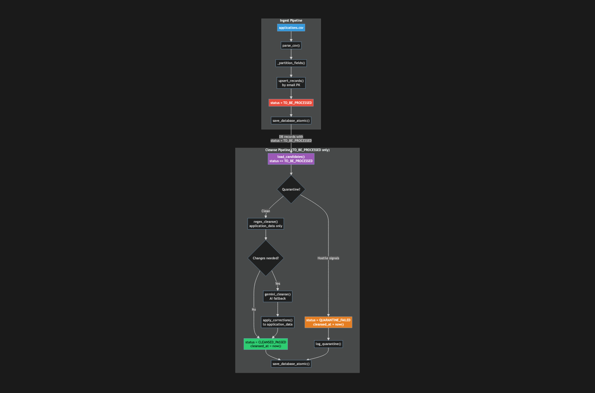
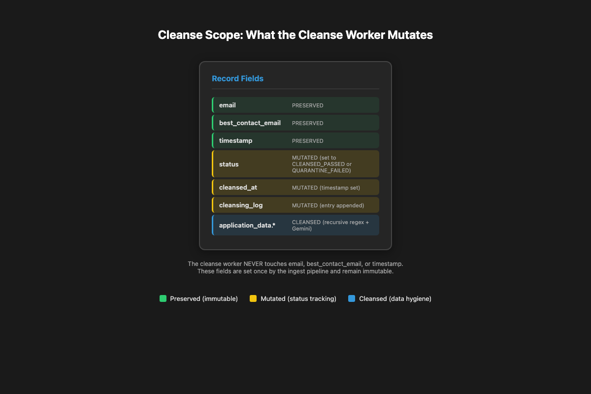

# Issue #81 – PRD-2 Re-implementation: Fix Status Lifecycle & Cleanse Scope

## Summary

Fix the ingest → cleanse pipeline integration so that records enter the system as `TO_BE_PROCESSED`, the cleanse pipeline exclusively cleanses fields nested inside `application_data`, and only the `status` and `cleansed_at` top-level fields are mutated by the cleanse worker. The current `ingest_pipeline.py` incorrectly marks new records as `CLEANSED_PASSED`, bypassing the cleanse step entirely.

---

## Root Cause Analysis

### Current Behavior (Bug)

In `ingest_pipeline.py`, the `upsert_records()` function assigns `status = "CLEANSED_PASSED"` to **all** new records:

```python
# ingest_pipeline.py: line 398
new_record = {
    "email": email,
    "timestamp": incoming_ts,
    "status": "CLEANSED_PASSED",  # ❌ Should be "TO_BE_PROCESSED"
    "application_data": app_data,
}
```

This means:
- Records never enter the `TO_BE_PROCESSED` state.
- `cleanse_pipeline.py` finds no `TO_BE_PROCESSED` candidates on first run.
- Data is ingested "clean" by assertion rather than by execution.
- The quarantine + regex + Gemini three-layer defense is skipped for all new data.

### Desired Behavior (Backlog PRD-2)

| Stage | Status | Meaning |
|-------|--------|---------|
| After Ingest | `TO_BE_PROCESSED` | Record is raw; awaiting cleanse |
| After Cleanse | `CLEANSED_PASSED` | Record has been through quarantine → regex → Gemini |
| After Quarantine | `QUARANTINE_FAILED` | Hostile signals detected; needs manual review |

**Cleanse scope rules:**
- **Cleanse:** All fields inside `application_data` (recursive)
- **Preserve:** `email`, `best_contact_email`, `timestamp` at top level
- **Mutate by cleanse worker only:** `status`, `cleansed_at`, `cleansing_log`

---

## Proposed Solution

### Fix 1: Ingest Pipeline — Set `TO_BE_PROCESSED` on New/Upsert Records

When a record is newly inserted **or** when an existing record's `application_data` is updated with newer timestamp data, reset its `status` to `TO_BE_PROCESSED` so it re-enters the cleanse queue.

**Before (bug):**
```python
new_record["status"] = "CLEANSED_PASSED"
```

**After (fix):**
```python
new_record["status"] = "TO_BE_PROCESSED"
```

Similarly, when an existing record's `application_data` is overwritten by newer data, reset `status` to `TO_BE_PROCESSED`.

### Fix 2: Cleanse Pipeline — Confirm `TO_BE_PROCESSED`-Only Filtering

Verify that `load_candidates()` and the orchestrator only operate on records where `status == "TO_BE_PROCESSED"`. Remove the fallback that also processes `CLEANSED_PASSED` records unless explicitly requested for re-cleansing.

### Fix 3: Cleanse Scope — Preserve Top-Level Fields

The existing `regex_cleanse()` already limits mutation to `application_data` (verified in current code). Add an explicit guarantee: if a quarantined or cleansed record has its top-level `email`, `best_contact_email`, or `timestamp` mutated, the test suite fails.

### Fix 4: Status Lifecycle Test Suite

Create an adversarial test that walks the full lifecycle:
1. Ingest CSV → assert `status == "TO_BE_PROCESSED"`
2. Run cleanse → assert `status == "CLEANSED_PASSED"` and `cleansed_at` is set
3. Ingest newer CSV for same email → assert `status` resets to `"TO_BE_PROCESSED"`
4. Run cleanse again → assert `status == "CLEANSED_PASSED"`

---

## Files to Modify

| File | Change |
|------|--------|
| `ingest_pipeline.py` | In `upsert_records()`, set `status = "TO_BE_PROCESSED"` for new records. When updating existing records with newer data, also reset `status = "TO_BE_PROCESSED"`. Remove `CLEANSED_PASSED` assignment. |
| `cleanse_pipeline.py` | In `run_cleanse_pipeline()`, remove the `CLEANSED_PASSED` fallback from candidate loading unless explicitly configured for re-cleansing. Confirm `load_candidates()` returns only `TO_BE_PROCESSED` by default. |
| `tests/test_ingest_pipeline.py` | Add test asserting new records have `status == "TO_BE_PROCESSED"`. |
| `tests/test_cleanse_pipeline.py` | Add test asserting cleanse only mutates `application_data`, not top-level fields. Add lifecycle test (TO_BE_PROCESSED → CLEANSED_PASSED). |

## New Files

| File | Purpose |
|------|---------|
| `tests/adversarial_test_issue81.py` | Full lifecycle adversarial tests: ingest → cleanse → re-ingest → re-cleanse, with assertions on status transitions and top-level field immutability. |

---

## Implementation Steps

1. **Update `ingest_pipeline.py`**
   - Line ~398: Change `status = "CLEANSED_PASSED"` → `status = "TO_BE_PROCESSED"` for new records.
   - Line ~390: When updating an existing record with newer timestamp data, also set `status = "TO_BE_PROCESSED"`.
   - Update docstrings to reflect that ingest sets `TO_BE_PROCESSED`.

2. **Update `cleanse_pipeline.py`**
   - In `load_candidates()`, return only `TO_BE_PROCESSED` records by default.
   - Add an optional `include_re cleansed: bool = False` parameter for future re-cleansing use.
   - Update `run_cleanse_pipeline()` docstring to document the TO_BE_PROCESSED-only behavior.

3. **Write adversarial tests (`tests/adversarial_test_issue81.py`)**
   - `test_ingest_sets_to_be_processed` — ingest CSV → assert all records `status == "TO_BE_PROCESSED"`
   - `test_cleanse_leaves_top_level_intact` — after cleanse, assert `email`, `best_contact_email`, `timestamp` are unchanged
   - `test_cleanse_sets_cleansed_passed` — after cleanse, assert `status == "CLEANSED_PASSED"` and `cleansed_at` is ISO-8601
   - `test_upsert_reset_status` — ingest, cleanse, ingest newer data for same email → assert status resets to `TO_BE_PROCESSED`
   - `test_quarantine_sets_quarantine_failed` — inject hostile pattern → assert `status == "QUARANTINE_FAILED"`
   - `test_full_lifecycle` — runs all steps in sequence

4. **Run existing tests**
   - Ensure `test_ingest_pipeline.py` and `test_cleanse_pipeline.py` still pass.
   - Update any test assertions that assume `CLEANSED_PASSED` after ingest.

5. **Run adversarial tests**
   - `python tests/adversarial_test_issue81.py` — all must pass.

6. **Documentation**
   - Update module docstrings for `ingest_pipeline.py` and `cleanse_pipeline.py`.
   - Update PRD-2 backlog → completed.

---

## Test Strategy

### Unit Tests
- `test_new_record_status_is_to_be_processed` — verifies `upsert_records` assigns correct status.
- `test_existing_record_reset_on_update` — verifies status resets when newer data arrives.

### Integration Tests
- `test_ingest_then_cleanse_lifecycle` — full pipeline run: CSV → Database.json → cleanse → verify `CLEANSED_PASSED`.
- `test_top_level_fields_immutable_during_cleanse` — verifies email, best_contact_email, timestamp survive cleanse untouched.

### Edge Cases
- **Empty application_data:** Record with no dynamic fields should still transition `TO_BE_PROCESSED` → `CLEANSED_PASSED`.
- **Quarantine path:** Quarantined record should have `status == "QUARANTINE_FAILED"`, not `CLEANSED_PASSED`.
- **Re-ingest same email:** Newer timestamp data should reset `status` to `TO_BE_PROCESSED` even if previously `CLEANSED_PASSED`.
- **Same timestamp, same data:** No update occurs, status should remain whatever it was.

---

## Risks & Mitigations

| Risk | Mitigation |
|------|------------|
| **Existing tests assume `CLEANSED_PASSED` after ingest** | Audit all test files; update assertions to expect `TO_BE_PROCESSED`. |
| **Downstream code expects `CLEANSED_PASSED` immediately** | The cleanse pipeline should be run immediately after ingest in production; document this in README. |
| **Records stuck in `TO_BE_PROCESSED`** | Add a health-check or timeout mechanism (future issue) to detect records that have been `TO_BE_PROCESSED` for too long. |
| **Re-cleanse of `CLEANSED_PASSED` records lost** | The optional `include_recleansed` parameter preserves this capability for future use. |

---

## Diagrams

### Status Lifecycle State Machine


### Pipeline Flow (Fixed)



### Cleanse Scope: What Gets Mutated



---

## Appendix: Corrected Record Lifecycle

### After Ingest

```json
{
  "email": "alice@startup.io",
  "best_contact_email": "alice@startup.io",
  "timestamp": "2024-06-01T12:00:00Z",
  "status": "TO_BE_PROCESSED",
  "application_data": {
    "company_name": "Alice AI",
    "industry": "SaaS"
  }
}
```

### After Cleanse

```json
{
  "email": "alice@startup.io",
  "best_contact_email": "alice@startup.io",
  "timestamp": "2024-06-01T12:00:00Z",
  "status": "CLEANSED_PASSED",
  "application_data": {
    "company_name": "Alice AI",
    "industry": "SaaS"
  },
  "cleansed_at": "2024-06-01T12:01:00Z",
  "cleansing_log": [
    {
      "action": "CLEANSED_PASSED",
      "timestamp": "2024-06-01T12:01:00Z",
      "reason": "Regex/Gemini cleanse completed"
    }
  ]
}
```

### After Quarantine

```json
{
  "email": "hostile@startup.io",
  "best_contact_email": "hostile@startup.io",
  "timestamp": "2024-06-01T12:00:00Z",
  "status": "QUARANTINE_FAILED",
  "application_data": {
    "company_name": "<script>alert(1)</script>"
  },
  "cleansed_at": "2024-06-01T12:01:00Z",
  "cleansing_log": [
    {
      "action": "QUARANTINE_FAILED",
      "timestamp": "2024-06-01T12:01:00Z",
      "reason": "Hostile pattern detected"
    }
  ]
}
```

### After Re-Ingest (Newer Data)

```json
{
  "email": "alice@startup.io",
  "best_contact_email": "alice@startup.io",
  "timestamp": "2024-06-15T09:30:00Z",
  "status": "TO_BE_PROCESSED",
  "application_data": {
    "company_name": "Alice AI 2.0",
    "industry": "SaaS",
    "funding": "Series A"
  }
}
```

---

## Summary of Changes from Original Plan

| Original Plan (Wrong) | Corrected Plan (Per Your Feedback) |
|-----------------------|-----------------------------------|
| Migrate schema to `raw_payload_snapshot` + `cleansed_payload` | Keep current schema: `application_data` + `status` + `cleansing_log` |
| Drop `status` field entirely | Keep `status`; fix lifecycle (TO_BE_PROCESSED → CLEANSED_PASSED) |
| Ingest pipeline sets `cleansed_payload = null` | Ingest pipeline sets `status = "TO_BE_PROCESSED"` |
| Cleanse pipeline reads `raw_payload_snapshot` | Cleanse pipeline reads `application_data`; cleanses nested fields only |
| All fields get cleansed | Only `application_data` fields get cleansed; top-level preserved |
