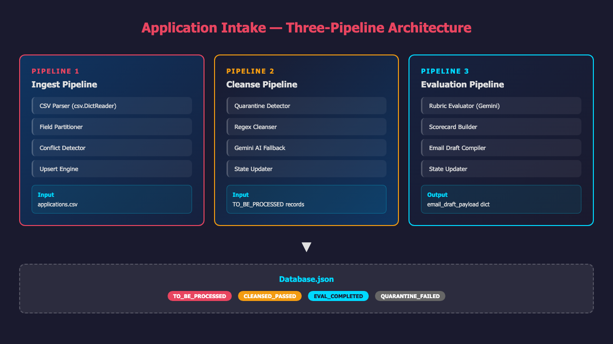
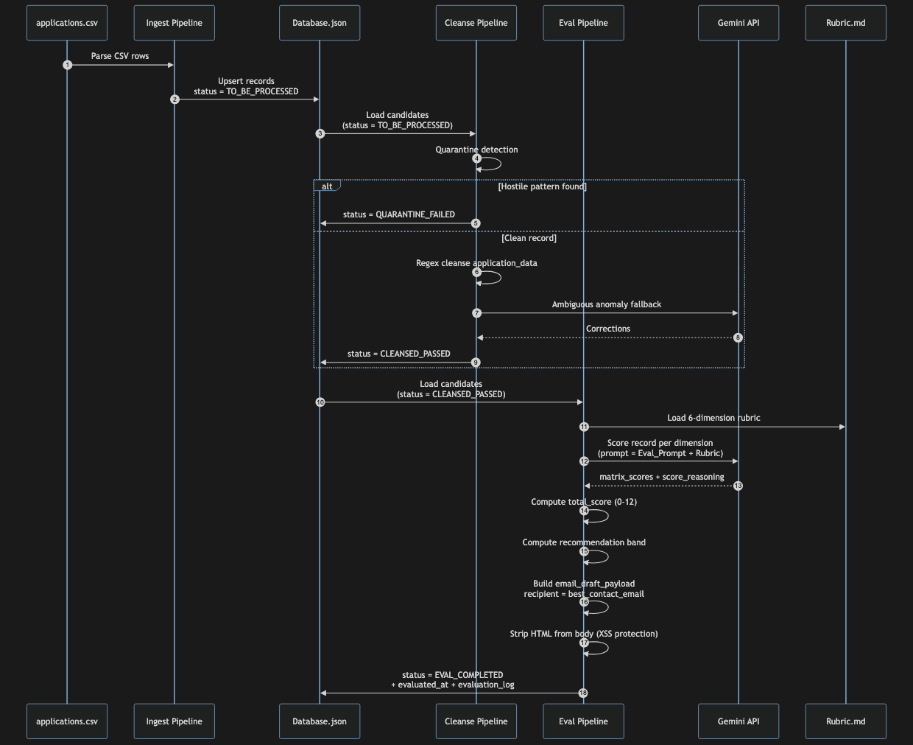
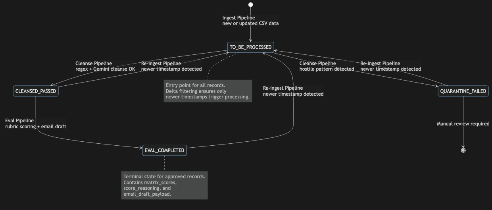

# Issue #81: PRD-3 Evaluation Engine & Applicant Feedback Pipeline

## Summary

Implement an automated evaluation engine (`eval_pipeline.py`) that reads cleansed application JSON records (status `CLEANSED_PASSED`), scores them against the 6-dimension rubric defined in `Rubric.md`, generates structured scorecards with per-dimension justifications, compiles personalized draft feedback emails addressed to `best_contact_email`, and transitions records to `EVAL_COMPLETED`.

## Root Cause Analysis

**Current State:** The Application Intake system has two operational pipelines:
1. **Ingest Pipeline** (`ingest_pipeline.py`) — parses CSV, partitions fields, detects conflicts, upserts records with `status = TO_BE_PROCESSED`
2. **Cleanse Pipeline** (`cleanse_pipeline.py`) — quarantine detection, regex cleansing, Gemini AI fallback, updates status to `CLEANSED_PASSED` or `QUARANTINE_FAILED`

**Gap:** There is no downstream processing after cleansing. Records remain in `CLEANSED_PASSED` state indefinitely. The rubric (`Rubric.md`) exists but is not programmatically consumed. No scoring, no feedback generation, and no email draft compilation exists.

**Desired State:** A third pipeline (`eval_pipeline.py`) that closes the loop by:
1. Loading records with `status == CLEANSED_PASSED`
2. Scoring each record against the 6 rubric dimensions using the Gemini API
3. Recording `matrix_scores` (0-2 per dimension) and `score_reasoning` (justification text)
4. Computing an overall score (0-12) and recommendation band (Strong/Conditional/No-go)
5. Generating an `email_draft_payload` dict with recipient=`best_contact_email`, subject, body (markdown), and `generated_at` timestamp
6. Transitioning status to `EVAL_COMPLETED`

## Proposed Solution

Build a new `eval_pipeline.py` module following the same architectural patterns as the existing pipelines:

| Pattern | Existing | New (Evaluation) |
|---------|----------|------------------|
| Entry point | `run_pipeline()` | `run_eval_pipeline()` |
| Candidate loading | `load_candidates()` | `load_eval_candidates()` |
| Core engine | `regex_cleanse()` + `gemini_cleanse()` | `evaluate_record()` + `build_email_draft()` |
| State update | `update_state()` | `update_eval_state()` |
| Persistence | `save_database_atomic()` | Reuse existing |

The evaluation engine will use the existing `gemini_call()` from `tools/gemini_call.py` with a structured prompt built from `Eval_Prompt.md` + `Rubric.md` content. Each dimension will be scored individually to ensure granular feedback.

### Email Draft Structure

```python
email_draft_payload = {
    "recipient": "<best_contact_email>",
    "subject": "PCAIS Co-Funded POC Program — Application Feedback",
    "body": "<markdown feedback with scorecard>",
    "generated_at": "2024-06-20T12:00:00Z",
}
```

### XSS Protection

All text injected into `email_draft_payload["body"]` will pass through an HTML stripping function to prevent downstream XSS in mailing services.

## Files to Modify

| File | Change |
|------|--------|
| `README.md` | Add eval pipeline to project structure, usage section, and feature list |
| `ingest_pipeline.py` | Add `EVAL_COMPLETED` to allowed status transitions (if re-ingest should reset from EVAL_COMPLETED to TO_BE_PROCESSED on newer data) |
| `cleanse_pipeline.py` | Ensure `CLEANSED_PASSED` records can be re-cleansed if re-ingested (already supported via `load_candidates(include_recleaned=True)`) |

## New Files

| File | Purpose |
|------|---------|
| `eval_pipeline.py` | Main evaluation pipeline module — loads candidates, scores via Gemini, builds email drafts, updates state |
| `tools/eval_utils.py` | Shared utilities: HTML stripper, rubric JSON loader, scorecard formatter, recommendation band calculator |
| `tests/test_eval_pipeline.py` | pytest tests: candidate loading, scoring integration, email draft structure, state transitions, XSS stripping |
| `tests/adversarial_test_issue81.py` | Adversarial tests: full lifecycle ingest→cleanse→eval, empty application_data, quarantine isolation, best_contact_email routing |

## Implementation Steps

### Step 1: Create `tools/eval_utils.py`
1. `load_rubric(path)` — parse `Rubric.md` into structured dimension dicts (or use embedded JSON rubric)
2. `strip_html(text)` — regex-based HTML tag stripping for XSS prevention
3. `compute_recommendation_band(total_score: int) -> str` — map 0-12 to Strong/Conditional/No-go
4. `format_scorecard(matrix_scores, score_reasoning, total_score, band) -> str` — markdown formatter
5. `build_eval_prompt(record, rubric) -> str` — construct Gemini prompt from record + rubric

### Step 2: Create `eval_pipeline.py`
1. `load_eval_candidates(db_path)` — query `Database.json` for `status == CLEANSED_PASSED`
2. `evaluate_record(record, rubric)` — call Gemini via `gemini_call()` with structured prompt, parse 6 dimension scores + reasoning
3. `build_email_draft(record, matrix_scores, score_reasoning, total_score, band)` — construct `email_draft_payload` dict
4. `update_eval_state(record)` — set `status = EVAL_COMPLETED`, add `evaluated_at` timestamp, append to `evaluation_log`
5. `run_eval_pipeline(db_path, rubric_path)` — orchestrator: load candidates → evaluate → build drafts → update states → save atomically

### Step 3: Update `ingest_pipeline.py`
1. In `upsert_records()`: when updating an existing record with newer data, if current status is `EVAL_COMPLETED`, reset to `TO_BE_PROCESSED` so it re-enters the full pipeline

### Step 4: Write Tests
1. `tests/test_eval_pipeline.py` — unit tests for each function
2. `tests/adversarial_test_issue81.py` — adversarial lifecycle tests (already exists, extend with eval phase)

### Step 5: Update Documentation
1. `README.md` — add eval pipeline to project structure and usage
2. Run `pytest tests/ -v` to verify all tests pass

## Test Strategy

### Unit Tests (`tests/test_eval_pipeline.py`)
- `test_load_eval_candidates_only_cleansed_passed` — returns only `CLEANSED_PASSED` records
- `test_load_eval_candidates_empty_database` — empty DB returns []
- `test_load_eval_candidates_mixed_status` — ignores `TO_BE_PROCESSED`, `QUARANTINE_FAILED`, `EVAL_COMPLETED`
- `test_evaluate_record_returns_scores` — mock Gemini response, verify 6 dimension scores
- `test_evaluate_record_returns_reasoning` — verify justification text per dimension
- `test_compute_recommendation_band` — test all three bands (0-6, 7-9, 10-12)
- `test_build_email_draft_structure` — verify `recipient`, `subject`, `body`, `generated_at` keys
- `test_build_email_draft_uses_best_contact_email` — 100% routing accuracy
- `test_email_draft_body_contains_scorecard` — markdown table with scores
- `test_strip_html_removes_tags` — XSS protection
- `test_update_eval_state` — status transition, timestamp, log entry

### Integration Tests (`tests/adversarial_test_issue81.py`)
- `test_full_lifecycle_ingest_cleanse_eval` — end-to-end: CSV → ingest → cleanse → eval → verify `EVAL_COMPLETED`
- `test_eval_leaves_top_level_intact` — email, best_contact_email, timestamp unchanged after eval
- `test_eval_preserves_quarantine_records` — `QUARANTINE_FAILED` records never enter eval
- `test_reingest_resets_eval_completed` — newer CSV data resets `EVAL_COMPLETED` → `TO_BE_PROCESSED`
- `test_empty_application_data_eval` — record with empty `application_data` still evaluates (scores 0 with generic reasoning)
- `test_eval_idempotent` — running eval twice on same record does not duplicate email drafts in log

### Edge Cases
- Record with `best_contact_email == None` — skip evaluation, log issue
- Gemini API failure — retry 3x, then skip record and log error
- Very large `application_data` (> 1MB text) — skip Gemini call, log warning
- Malformed rubric file — fail fast with descriptive error
- HTML in application data — stripped in email draft body but preserved in raw record

## Risks & Mitigations

| Risk | Mitigation |
|------|------------|
| **Gemini API latency > 3s per record** | Implement concurrent evaluation with `asyncio` or `ThreadPoolExecutor` (max 10 workers). Cache Gemini responses keyed by SHA-256 of record + rubric hash. |
| **Gemini API costs scale with volume** | Response cache prevents duplicate evaluations. Batch dimension scoring in a single prompt (all 6 dimensions at once). |
| **Inconsistent scoring between runs** | Use temperature=0.0 for deterministic output. Parse structured output (JSON) instead of free text. |
| **XSS in email draft body** | Strip all HTML tags via `strip_html()` before storing in `email_draft_payload`. |
| **Memory usage > 512MB** | Process records in streaming fashion (one at a time). Don't load entire database into memory for candidate filtering. |
| **best_contact_email routing errors** | Explicit assertion in tests. Validate email format before storing draft. |
| **Rubric changes break parsing** | Embed rubric as versioned JSON file instead of parsing Markdown. Version lock the rubric schema. |

## Diagrams

### Architecture Overview



### Data Flow



### Record State Machine



---

## Appendix: Rubric Dimensions (from `Rubric.md`)

| # | Dimension | Score Range |
|---|-----------|-------------|
| 1 | Venture Description | 0–2 |
| 2 | Value Chain Use Case | 0–2 |
| 3 | AI Journey Self-Assessment | 0–2 |
| 4 | Accelerator & Industry Support | 0–2 |
| 5 | Team Capabilities & Resourcing | 0–2 |
| 6 | Venture Funding | 0–2 |

**Overall Score:** Sum of dimensions (max 12)

| Score | Band | Action |
|-------|------|--------|
| 10–12 | Strong | Recommend for program |
| 7–9 | Conditional | Recommend with required improvements |
| ≤6 | No-go | Decline with feedback |

## Appendix: Status Lifecycle

```
applications.csv
     │
     ▼
┌─────────────────┐
│  TO_BE_PROCESSED │ ←── Ingest Pipeline (new / updated records)
└────────┬────────┘
         │
         ▼
┌─────────────────┐
│ CLEANSED_PASSED  │ ←── Cleanse Pipeline (quarantine → regex → Gemini)
└────────┬────────┘
         │
         ▼
┌─────────────────┐
│ EVAL_COMPLETED   │ ←── Evaluation Pipeline (rubric scoring + email draft)
└─────────────────┘
```

## Appendix: Data Model for Evaluation Records

```python
{
  "email": "primary@example.com",           # Primary key
  "best_contact_email": "contact@example.com",  # Email draft recipient
  "status": "EVAL_COMPLETED",
  "timestamp": "2024-06-01T12:00:00Z",
  "cleansed_at": "2024-06-01T12:05:00Z",
  "evaluated_at": "2024-06-01T12:10:00Z",
  "application_data": { ... },
  "matrix_scores": {
    "venture_description": 2,
    "value_chain_use_case": 1,
    "ai_journey_self_assessment": 2,
    "accelerator_industry_support": 1,
    "team_capabilities_resourcing": 2,
    "venture_funding": 0,
  },
  "score_reasoning": {
    "venture_description": "Compelling, evidenced venture...",
    "value_chain_use_case": "Reasonable use case with some value-chain linkage...",
    # ... etc
  },
  "email_draft_payload": {
    "recipient": "contact@example.com",
    "subject": "PCAIS Co-Funded POC Program — Application Feedback",
    "body": "# Application Feedback\n\n## Scorecard\n...",
    "generated_at": "2024-06-01T12:10:00Z",
  },
  "cleansing_log": [...],
  "evaluation_log": [
    {
      "action": "EVAL_COMPLETED",
      "timestamp": "2024-06-01T12:10:00Z",
      "total_score": 8,
      "band": "Conditional",
    }
  ],
}
```
